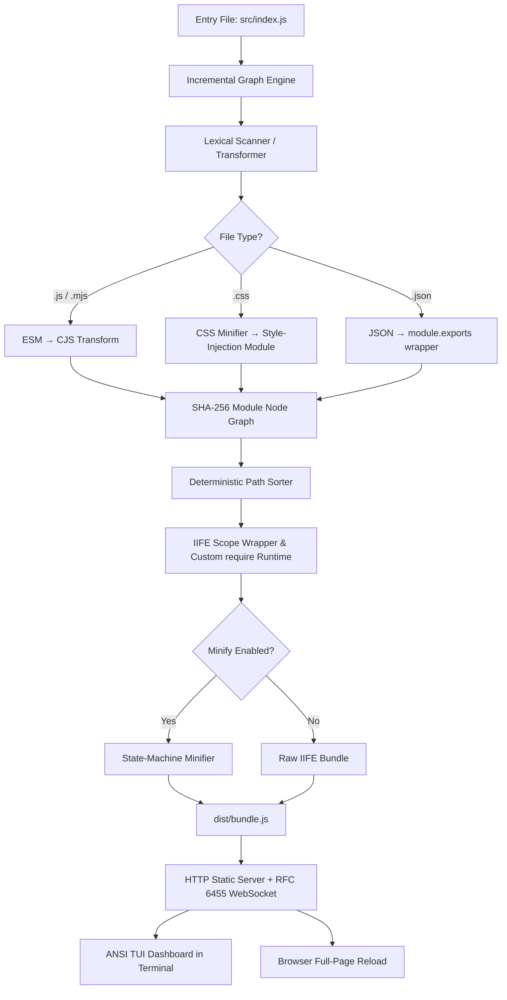

# ⚡ ZeroPack

<div align="center">

```
   ______                 ____             __   
  / ____/___  _________  / __ \____ ______/ /__ 
 / /_  / __ \/ ___/ __ \/ /_/ / __ `/ ___/ //_/ 
/ __/ / /_/ / /  / /_/ / ____/ /_/ / /__/ ,<    
/_/    \____/_/   \____/_/    \__,_/\___/_/|_|   
```

**The 100% Zero-Dependency JavaScript Bundler, Minifier, CSS Bundler & RFC 6455 Live Reload Dev Server.**  
*Built strictly with Node.js built-in core libraries.*

[-brightgreen.svg?style=for-the-badge&logo=node.js)](package.json)
[](package.json)
[](src/server.js)
[](src/build-tools.js)
[](LICENSE)

</div>

---

## 📖 Table of Contents

- [Overview](#-overview)
- [Zero-Dependency Matrix](#-zero-dependency-matrix)
- [Key Features](#-key-features)
- [Module & File Support](#-module--file-support)
- [Quick Start](#-quick-start)
- [CLI Reference](#-cli-reference)
- [All npm Scripts](#-all-npm-scripts)
- [Architecture & How It Works](#-architecture--how-it-works)
- [Repository Structure](#-repository-structure)
- [Verification & Testing](#-verification--testing)
- [License](#-license)

---

## 🌟 Overview

**ZeroPack** is a genuine developer tool engineered for environments requiring **0 runtime third-party dependencies** — `"dependencies": {}` and `"devDependencies": {}`.

Instead of pulling thousands of packages from npm (`webpack`, `esbuild`, `terser`, `chokidar`, `ws`, `express`, `commander`, `chalk`, `dotenv`, `postcss`, `css-loader`), ZeroPack implements a complete, modern frontend build toolchain using **pure Node.js standard libraries** (`node:fs`, `node:path`, `node:crypto`, `node:http`, `node:util`, `node:string_decoder`).

```bash
# No npm install needed — just clone and run
git clone https://github.com/Saksham842/Zero-Dependency.git
cd Zero-Dependency
node src/cli.js --help
```

---

## 📊 Zero-Dependency Matrix

Every industry-standard npm library has been replaced with a native Node.js core implementation:

| Standard NPM Package | ZeroPack Native Replacement | Core Node.js API | Purpose |
| :--- | :--- | :--- | :--- |
| **`commander`** / **`yargs`** | Native CLI Parser | `node:util.parseArgs` | Strict flag parsing (`--entry`, `--out`, `--serve`, `--watch`, etc.) |
| **`chalk`** / **`picocolors`** | ANSI Color Formatter | Raw `\x1b[...m` Escape Codes | Terminal coloring, TUI dashboard, and build reports |
| **`dotenv`** | Native `.env` Reader | `node:fs` + Line Stream Parser | Parses `.env` variables into `process.env` |
| **`esbuild`** / **`webpack`** | AST Lexer & Dependency Resolver | `node:fs`, `node:path`, `node:crypto` | Dependency graph, circular detection & IIFE bundling |
| **`terser`** / **`uglify-js`** | State-Machine Minifier | `node:string_decoder` | Comment stripping, whitespace trimming & string preservation |
| **`chokidar`** | Native File Watcher | `node:fs.watch` | 100ms debounced recursive file watcher |
| **`ws`** / **`socket.io`** | Native RFC 6455 Server | `node:http` + `node:crypto` | HTTP 101 upgrade handshake, frame encoder/decoder |
| **`mime`** / **`mime-types`** | Custom MIME Dictionary | Object Hash Table | 15+ MIME type headers (`.html`, `.js`, `.css`, `.wasm`, etc.) |
| **`crypto-js`** | Native Hash Calculator | `node:crypto` | SHA-256 module digests & SHA-1 WebSocket accept hashes |
| **`jest`** / **`mocha`** / **`vitest`** | Native Test Runner | `node:test` + `node:assert/strict` | Full test suite with async support, zero test framework dependencies |
| **`postcss`** / **`css-loader`** | Native CSS String Parser | `node:fs` + Regex Minifier | CSS import bundling: minify, escape, inject via `document.createElement('style')` |

---

## ✨ Key Features

- 🛡️ **0 Third-Party Dependencies:** 100% compliant with strict zero-dependency constraints.
- ⚡ **Blazing Fast Bundling:** Sub-60ms cold builds directly on Node.js.
- 🎨 **CSS Import Bundling:** `import './style.css'` works — CSS is minified and injected as a `<style>` tag at runtime.
- 🔄 **Native RFC 6455 WebSocket Live Reload:** Real-time full-page reloading without external WebSocket engines.
- 🗜️ **Built-in Minification:** State-machine lexer that strips comments and whitespace without corrupting strings or regex literals.
- 🖥️ **TUI Dashboard:** ANSI VT100 terminal UI that renders a live box with build stats and activity log — updates in-place on every rebuild.
- 🔒 **100% Deterministic Reproducible Builds:** Modules sorted lexicographically to guarantee bit-for-bit identical SHA-256 output across runs.
- 🛡️ **Robust Error Handling:** Comprehensive `BuildError` diagnostics pointing directly to file, line, and column.
- 🔄 **Stateful Watch Rebuilds:** Incremental graph engine caches SHA-256 hashes — only changed modules are reprocessed.
- 📦 **Single-File Distribution:** The entire bundler compiles into one standalone executable `zeropack.js`.
- 👁️ **`--watch` Mode:** Rebuild-on-change without starting the HTTP server — useful for libraries and CLI tools.

---

## 🧩 Module & File Support

| Feature | Status | Description |
| :--- | :--- | :--- |
| ESM imports (`import`) | ✅ Supported | Named, default, and namespace imports |
| Named exports | ✅ Supported | `export const`, `export function`, `export class` |
| Default exports | ✅ Supported | `export default function`, multiline objects |
| Re-exports | ✅ Supported | `export { x } from ...`, `export * from ...` |
| JSON modules | ✅ Supported | Parses JSON, ignores `with { type: 'json' }` |
| Dynamic imports | ✅ Supported | `import('./file.js')` mapped to Promise |
| **CSS imports** | ✅ **Supported** | **`import './style.css'` — minified & injected via `<style>` tag** |
| CommonJS require | ⚠️ Limited | `require()` works natively if strictly formatted |
| npm Package Resolution | ❌ Unsupported | Only resolves local relative paths (`./`, `../`) |
| TypeScript syntax | ❌ Unsupported | Resolves `.ts` extensions, but does not compile |
| JSX syntax | ❌ Unsupported | Resolves `.jsx` extensions, but does not compile |

---

## 🚀 Quick Start

### 1. Clone & Setup
```bash
git clone https://github.com/Saksham842/Zero-Dependency.git
cd Zero-Dependency

# No npm install needed!
```

### 2. Run Tests & Verify
```bash
npm test
# Runs 25 unit/integration tests via native node:test
```

### 3. Build Your Project
```bash
# Basic bundle (unminified)
node src/cli.js --entry src/index.js --out dist/bundle.js

# Production minified bundle
node src/cli.js --entry src/index.js --out dist/bundle.js --minify

# Or via npm script shorthand
npm run build
```

### 4. Start Dev Server with Live Reload
```bash
node src/cli.js --serve
# → http://localhost:3000/
# → TUI dashboard renders in terminal
# → http://localhost:3000/__zeropack (web dashboard)

# Or via npm script
npm run dev
```

### 5. Watch Mode (no server)
```bash
# Rebuilds on every file change — useful for libraries
node src/cli.js --watch

# With custom entry/output
node src/cli.js --entry src/main.js --out dist/lib.js --watch --minify
```

### 6. Use the Standalone Executable
```bash
# The entire bundler is one file — copy it anywhere Node.js >= 18 is available
node zeropack.js --entry src/index.js --out dist/bundle.js --minify
node zeropack.js --serve --port 8080
```

---

## 💻 CLI Reference

```
USAGE:
  node src/cli.js [options]
  node zeropack.js [options]

OPTIONS:
  --entry <path>      Entry JavaScript file          (default: src/index.js)
  --out <path>        Output bundle path             (default: dist/bundle.js)
  --serve             Start HTTP static dev server & RFC 6455 Live Reload
  --watch             Watch files and rebuild on change (no server)
  --port <number>     Port for the dev server        (default: 3000)
  --host <address>    Host to bind the dev server    (default: 127.0.0.1)
  --minify            Minify output (strips comments & whitespace)
  --env <path>        Path to .env file              (default: .env)
  --help, -h          Display this help message
```

### CLI Examples

```bash
# Build unminified bundle
node src/cli.js --entry src/index.js --out dist/bundle.js

# Build minified production bundle
node src/cli.js --entry src/index.js --out dist/bundle.js --minify

# Start dev server on default port 3000
node src/cli.js --serve

# Dev server on custom port + host
node src/cli.js --serve --port 8080 --host 0.0.0.0

# Watch mode — rebuild on save, no HTTP server
node src/cli.js --watch

# Watch + minify
node src/cli.js --entry src/index.js --out dist/bundle.js --watch --minify

# Custom .env file
node src/cli.js --serve --env .env.production

# Bundle entry as positional argument
node src/cli.js src/main.js --out dist/app.js --minify

# Use standalone single-file executable
node zeropack.js --entry src/index.js --minify
```

---

## 📋 All npm Scripts

| Command | What It Does |
| :--- | :--- |
| `npm start` | Run CLI with default parameters (`src/index.js → dist/bundle.js`) |
| `npm run dev` | Start dev server with TUI + Live Reload on port 3000 |
| `npm run build` | Compile and minify `src/index.js` into `dist/bundle.js` |
| `npm test` | Run the full 25-test suite via native `node:test` |
| `npm run verify` | Read-only reproducible build audit (no files modified) |
| `npm run check` | Full CI gate: `npm test && npm run verify` |
| `npm run build-standalone` | Regenerate `zeropack.js` + STDLIB.md + verify reproducibility |

---

## 🧠 Architecture & How It Works



### 1. CLI & Environment Engine ([`src/cli.js`](src/cli.js))
- Uses `node:util.parseArgs` for strict, scriptable CLI argument parsing.
- Supports `--entry`, `--out`, `--serve`, `--watch`, `--port`, `--host`, `--minify`, `--env`.
- Native `.env` reader parses line-by-line, strips comments, handles quoted values.
- ANSI color utility provides vibrant terminal output with raw escape codes.
- `--watch` mode: `fs.watch` with 100ms debounce, incremental rebuild loop, no HTTP server.

### 2. Incremental Dependency Graph ([`src/graph.js`](src/graph.js))
- Maintains an in-memory module cache keyed by absolute path.
- Computes SHA-256 of each file — only reprocesses modules whose content changed.
- Tracks reverse dependency edges (dependents) for cascading invalidation.
- Falls back to a full rebuild if the graph is inconsistent.

### 3. Lexical Scanner & Transformer ([`src/parser.js`](src/parser.js))
- Single-pass character-by-character scanner — no third-party AST.
- Transforms `import`/`export` ESM syntax into CommonJS `require`/`module.exports`.
- Detects circular dependencies via a recursion stack.
- **CSS files**: minifies with `minifyCss()` (strips comments, collapses whitespace) then wraps in a style-injection JS module.
- **JSON files**: wraps with `module.exports = {...}`.
- Structured `BuildError` with file, line, column, and suggestion.

### 4. State-Machine Minifier ([`src/bundler.js`](src/bundler.js))
A streaming state-machine that iterates character-by-character:
- Strips `//` single-line comments and `/* ... */` multi-line comments.
- Accurately tracks `'`, `"`, and `` ` `` boundaries to preserve string contents.
- Strips non-essential whitespace while maintaining operator/keyword boundaries.

### 5. Native RFC 6455 WebSocket Live Reload Server ([`src/server.js`](src/server.js))
- **Handshake:** Intercepts `upgrade` requests, computes `Sec-WebSocket-Accept` via SHA-1.
- **Frame Encoder/Decoder:** Handles 7-bit, 16-bit, and 64-bit payload length headers; decodes client masking.
- **Watcher & Broadcaster:** `fs.watch` detects changes, recompiles, broadcasts `{ type: 'reload' }`.
- **TUI Dashboard:** Renders a live ANSI box in the terminal using VT100 cursor-up + erase-line to update in-place.

### 6. Reproducible Build Verifier ([`src/build-tools.js`](src/build-tools.js))
Runs two sequential builds on identical source trees and compares SHA-256 hashes byte-for-byte.

---

## 🏗️ Repository Structure

```
Zero-Dependency/
├── src/
│   ├── cli.js           CLI entry: arg parsing, .env loader, ANSI logger, --watch loop
│   ├── parser.js        Lexical scanner, ESM→CJS transform, CSS bundler, BuildError
│   ├── graph.js         Incremental dependency graph engine with hash-based cache
│   ├── bundler.js       IIFE generator, state-machine minifier, bundleToFile
│   ├── server.js        HTTP server, RFC 6455 WebSocket HMR, ANSI TUI dashboard
│   ├── dashboard.js     Web developer dashboard HTML (served at /__zeropack)
│   ├── build-tools.js   Standalone compiler, reproducible build verifier, STDLIB doc gen
│   ├── sample.js        Demo app scaffolder (writes index.js, utils.js, styles.css, etc.)
│   ├── index.js         Demo entry point (imports styles.css + renders app)
│   ├── components.js    Demo UI component (uses CSS classes)
│   ├── styles.css       Demo CSS (variables, card layout, @keyframes, badges)
│   ├── math.js          Demo math utilities
│   └── utils.js         Demo formatting utilities
├── test/
│   ├── parser-bundler.test.js   ESM transforms, CSS bundling, bundle execution via vm
│   ├── diagnostics.test.js      BuildError structure, file/line/col accuracy
│   ├── incremental.test.js      Incremental graph rebuild cache behaviour
│   ├── reliability.test.js      Concurrent rebuild queue, pendingBuild safety
│   ├── server-security.test.js  Path traversal prevention, MIME types, 404s
│   └── verify.test.js           Reproducible build and read-only artifact verification
├── public/
│   └── index.html       Default HTML served by dev server
├── dist/
│   └── bundle.js        Pre-built minified bundle
├── zeropack.js          Single-file standalone executable (all src modules concatenated)
├── package.json         name: zeropack, type: module, dependencies: {}, devDependencies: {}
├── STDLIB.md            Standard library replacement matrix (11 substitutions)
└── README.md            This file
```

---

## 🧪 Verification & Testing

ZeroPack includes 25 automated tests across 6 test files using the native `node:test` runner:

```bash
# Run the full test suite
npm test

# Run a single test file
node --test test/parser-bundler.test.js

# Full pre-submission check: tests + reproducible build audit
npm run check
```

**Test coverage:**
- ESM import/export transformation (named, default, namespace, re-exports, dynamic)
- CSS import bundling (minifier, transform output, end-to-end style injection)
- JSON module handling
- BuildError diagnostics (file, line, column, suggestion)
- Incremental graph cache (hits, misses, file removal)
- Concurrent rebuild queue safety
- HTTP path traversal prevention
- MIME type resolution
- RFC 6455 WebSocket upgrade rejection
- Server lifecycle (start, stop, no hanging)
- Reproducible build — byte-for-byte SHA-256 verification

---

## 📦 Single-File Standalone Distribution

ZeroPack includes a standalone single-file compiler that packages the entire CLI, parser, bundler, and server into one executable `zeropack.js`:

```bash
# Regenerate the standalone distribution
npm run build-standalone

# Run directly from the single file anywhere Node.js >= 18 is available
node zeropack.js --entry src/index.js --out dist/bundle.js --minify
node zeropack.js --serve --port 3000
node zeropack.js --watch
node zeropack.js --help
```

---

## 📄 License

MIT © ZeroPack Team. Built for the Zero Dependency | 72-Hour Hackathon.
