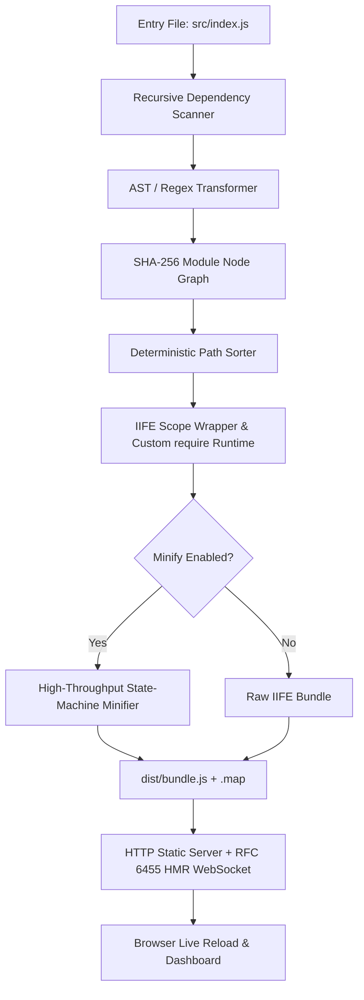

# ⚡ ZeroPack

<div align="center">

```
   ______                 ____             __   
  / ____/___  _________  / __ \____ ______/ /__ 
 / /_  / __ \/ ___/ __ \/ /_/ / __ `/ ___/ //_/ 
/ __/ / /_/ / /  / /_/ / ____/ /_/ / /__/ ,<    
/_/    \____/_/   \____/_/    \__,_/\___/_/|_|   
```

**The 100% Zero-Dependency JavaScript Bundler, Minifier & RFC 6455 HMR Dev Server.**  
*Built strictly with Node.js built-in standard libraries.*

[](https://github.com/Saksham842/Zero-Dependency/actions)
[](https://zero-dependency-beta.vercel.app/)
[-brightgreen.svg?style=for-the-badge&logo=node.js)](package.json)
[](package.json)
[](src/server.js)
[](src/build-tools.js)
[](LICENSE)

<br/>

### 🌐 Live Production Deployments
**[⚡ ZeroPack Web Studio (Interactive App)](https://zero-dependency-beta.vercel.app/)** • **[📊 Developer Dashboard](https://zero-dependency-beta.vercel.app/dashboard.html)** • **[📡 Zero-Dep Stats API](https://zero-dependency-beta.vercel.app/api/stats)**

</div>

---

## 📖 Table of Contents

- [Overview](#-overview)
- [ZeroPack Web Studio & Interactive Playground](#-zeropack-web-studio--interactive-playground)
- [Developer Dashboard & Telemetry](#-developer-dashboard--telemetry)
- [Zero-Dependency Standard Library Matrix](#-zero-dependency-standard-library-matrix)
- [Key Features](#-key-features)
- [Quick Start](#-quick-start)
  - [1. Zero-Config Experience](#1-zero-config-experience)
  - [2. Scaffold a Starter Project](#2-scaffold-a-starter-project)
  - [3. Production Builds](#3-production-builds)
  - [4. Development Server & HMR](#4-development-server--hmr)
- [CLI Reference](#-cli-reference)
  - [Subcommands](#subcommands)
  - [Options & Flags](#options--flags)
  - [Configuration File (`zeropack.config.json`)](#configuration-file-zeropackconfigjson)
- [TypeScript Support & Engine Caveats](#-typescript-support--engine-caveats)
- [Performance Benchmarks](#-performance-benchmarks)
- [Architecture & How It Works](#-architecture--how-it-works)
  - [1. Lexer & Single-Pass State Machine Minifier](#1-lexer--single-pass-state-machine-minifier)
  - [2. Dependency Graph & ESM-to-CJS Transformer](#2-dependency-graph--esm-to-cjs-transformer)
  - [3. Scoped IIFE Runtime & Live Bindings](#3-scoped-iife-runtime--live-bindings)
  - [4. Native RFC 6455 WebSocket Dev Server](#4-native-rfc-6455-websocket-dev-server)
  - [5. Incremental Build Cache](#5-incremental-build-cache)
  - [6. Reproducible Build Verification](#6-reproducible-build-verification)
- [Real-World Validation & Differential Testing](#-real-world-validation--differential-testing)
- [Single-File Standalone Distribution (`zeropack.js`)](#-single-file-standalone-distribution-zeropackjs)
- [Project Scripts](#-project-scripts)
- [License](#-license)

---

## 🌟 Overview

**ZeroPack** was engineered for high-stakes competition environments, minimal containers, air-gapped systems, and zero-trust workflows requiring **STRICTLY 0 external runtime or dev dependencies** (`dependencies: {}` and `devDependencies: {}` in `package.json`).

Instead of pulling down hundreds of third-party packages from npm (`webpack`, `esbuild`, `terser`, `chokidar`, `ws`, `express`, `commander`, `chalk`, `dotenv`, `source-map`), ZeroPack delivers a complete, production-ready frontend build toolchain built exclusively with **pure Node.js standard libraries** (`node:fs`, `node:path`, `node:crypto`, `node:http`, `node:util`, `node:string_decoder`, `node:zlib`, `node:net`, `node:child_process`, and raw ANSI escape sequences).

---

## 🛠️ ZeroPack Web Studio & Interactive Playground

ZeroPack includes a modern **Web Studio** developer tool and reactive playground live in production at **[zero-dependency-beta.vercel.app](https://zero-dependency-beta.vercel.app/)**:

- **Multi-File Tabbed Code Editor:** Live editor with keyboard shortcuts (`Ctrl+Enter` to bundle and run) supporting `index.js`, `math.js`, `utils.js`, and `styles.css`.
- **Pre-Configured Presets:** Instant switching between interactive demonstrations:
  - `📐 Geometry Engine`: Mathematical circle and sphere volume calculations with real-time updates.
  - `⚡ Counter Store`: State-management pattern with dispatch and action reducer loops.
  - `🔄 Cyclic ESM Graph`: Demonstrates cyclic import handling with native ESM parity.
- **Client-Side Bundler & Minifier Engine:** Bundles multi-file modules client-side in sub-millisecond real time with live compression savings telemetry.
- **Multi-Tab Production Inspector:**
  - `⚡ Live App`: Sandboxed safe execution of bundled code with runtime output cards.
  - `📦 Bundle Output`: Formatted single-file CommonJS/ESM runtime wrapper with scoped module table.
  - `🗜️ Minified`: Real-time token minification with compression percentage.
  - `🕸️ Module Graph`: Interactive SVG dependency topology mapping AST import linkages.
- **Interactive Geometry REPL:** Responsive slider dynamically recalculating Circle Area ($\pi r^2$), Circumference ($2\pi r$), and Sphere Volume ($\frac{4}{3}\pi r^3$) in real time with dynamic SVG canvas rendering.

---

## 📊 Developer Dashboard & Telemetry

When running locally (`zeropack serve`) or in production at **[`/dashboard.html`](https://zero-dependency-beta.vercel.app/dashboard.html)**, ZeroPack provides an obsidian dark-theme developer telemetry dashboard:

1. **Overview & Telemetry:** High-contrast metric cards displaying Total Modules, Minified Bundle Size, Gzip Compression via `node:zlib`, and Build Latency in milliseconds.
2. **Top Module Distribution:** Visual progress bars displaying the largest modules by raw byte size and gzip-compressed byte size.
3. **Interactive SVG Dependency Topology Graph:** Renders module nodes with directed arrow markers, module IDs, and hover tooltips detailing raw & gzip footprints.
4. **Bundle Size Treemap:** Proportional rectangular squarified treemap with instant toggling between raw byte weights and gzip-compressed sizes.
5. **Rebuild History Timeline:** Rebuild logs showing status (`SUCCESS` / `ERROR`), file paths, timestamps, and build durations.
6. **Live Terminal Log Console:** Real-time log streamer powered by RFC 6455 WebSocket events.

---

## 📊 Zero-Dependency Standard Library Matrix

Every ecosystem npm utility has a custom, native Node.js core replacement:

| Ecosystem NPM Package | ZeroPack Native Replacement | Node.js Standard API | Purpose |
| :--- | :--- | :--- | :--- |
| **`commander`** / **`yargs`** | Native CLI Flag & Command Parser | `node:util.parseArgs` | Strict flag parsing (`--entry`, `--out`, `--minify`, `--sourcemap`, `--define.<K>=<V>`, subcommands) |
| **`chalk`** / **`picocolors`** | ANSI Color & Style Formatter | Raw `\x1b[...m` Codes | Terminal formatting, error frames, and audit banners without dependencies |
| **`dotenv`** | Native `.env` Stream Parser | `node:fs` + Line Lexer | Safely loads `.env` variables into `process.env` without polluting shell scopes |
| **`esbuild`** / **`webpack`** | DAG Scanner & IIFE Hoister | `node:fs`, `node:path`, `node:crypto` | Dependency graph, cycle detection, alias resolution, and scoped bundle packaging |
| **`resolve`** / **`enhanced-resolve`** | Native Module Resolution Engine | `node:fs` + `node:path` | Bare `node_modules` resolution (`exports`, `module`, `main`, and index fallbacks) |
| **`source-map`** / **`vlq`** | Hand-Crafted Base64-VLQ Engine | Custom 6-bit VLQ Math | SourceMap v3 generator supporting inline data URIs and `.map` files |
| **`ts-loader`** / **`@babel/preset-typescript`** | Native Type Stripping Engine | `node:module.stripTypeScriptTypes` | Direct `.ts` type stripping without third-party transpilers (Node >= 22.6) |
| **`terser`** / **`uglify-js`** | High-Throughput Lexer Minifier | `node:string_decoder` + `Uint8Array` | Strips comments & whitespace while preserving ASI, quotes, regex, and `${}` (>45 MB/s) |
| **`chokidar`** | Recursive Directory Watcher | `node:fs.watch` | 100ms debounced file watcher with incremental rebuild triggers and cross-platform fallbacks |
| **`ws`** / **`socket.io`** | Native RFC 6455 WebSocket Server | `node:http` + `node:crypto` + `node:net` | Full WebSocket protocol: HTTP 101 upgrade handshake, binary frame encoding/decoding |
| **`compression`** / **`gzip-size`** | In-Memory Gzip Calculator | `node:zlib.gzipSync` | Bundle and per-module compressed metrics with memoized incremental caching |
| **`open`** / **`opener`** | Cross-Platform Browser Launcher | `node:child_process.exec` | Launches default browser (`start` on Windows, `open` on macOS, `xdg-open` on Linux) |
| **`detect-port`** / **`get-port`** | Sequential Port Conflict Scanner | `node:net.createServer` | Probes sequential ports to find an available port when `--auto-port` is enabled |
| **`mime`** / **`mime-types`** | Custom MIME Dictionary | Object Hash Table | Resolves 15+ web MIME types with UTF-8 charset annotations |
| **`webpack-bundle-analyzer`** | Pure SVG Visualizer & Dashboard | Native `node:http` Web Server | Built-in UI at `/__zeropack` rendering interactive SVG dependency graphs and treemaps |
| **`crypto-js`** | Native Cryptographic Engine | `node:crypto` | SHA-256 for deterministic caching and SHA-1 for Sec-WebSocket-Key handshakes |

---

## ✨ Key Features

- 🛡️ **0 External Dependencies:** Both `"dependencies"` and `"devDependencies"` in `package.json` are strictly `{}`.
- ⚡ **Lightning Fast:** ~1 ms cold builds on small apps, ~68 ms on 500-module projects, and ~22 ms incremental rebuilds.
- 🗺️ **Source Maps v3:** Hand-crafted Base64-VLQ variable-length quantity encoder generating standard SourceMap v3 `.map` files.
- 📦 **node_modules Resolution:** Resolves bare package imports following Node's module algorithm (`exports`, `module`, `main`, and index fallbacks).
- 🔷 **Native TypeScript Support:** Automatic `.ts` type stripping using native Node core (Node >= 22.6) with graceful runtime feature checks.
- 🖥️ **Developer Dashboard (`/__zeropack` & `/dashboard.html`):** Linear/Vercel-grade obsidian web UI featuring interactive SVG dependency graphs, proportional Gzip treemaps, build timeline history, and streaming WebSocket logs.
- 🚨 **Full-Screen Error Overlay:** Browser compiler error overlay displaying exact file paths, line numbers, and formatted code frames.
- 🎨 **CSS Hot-Swap:** Instant stylesheet replacement over WebSocket without re-executing JavaScript or losing DOM input state.
- 🔄 **Native RFC 6455 WebSocket HMR:** Real-time live reloading with automatic exponential backoff reconnection.
- 🗜️ **High-Throughput State-Machine Minifier:** Lexer preserving ASI (Automatic Semicolon Insertion), operator spacing (`+ +`, `- -`), regex literals vs. division, and nested template literals with `${}` (>45 MB/s).
- 🧩 **Comprehensive ESM $\to$ CJS Transforms:** Destructured exports (`export const {x} = obj`), namespace re-exports (`export * as ns`), import attributes (`with`/`assert`), dynamic imports (`import()`), and live getter bindings.
- 🔒 **100% Deterministic Reproducible Builds:** Lexicographically sorted module DAGs produce bit-for-bit identical SHA-256 hashes across repeated builds.
- 📦 **Single-File Distribution:** Self-contained executable `zeropack.js` runnable without installation.

---

## 🚀 Quick Start

### 1. Zero-Config Experience

Running ZeroPack with zero flags automatically detects your project entry point, finds an available port if default port 3000 is occupied, starts the dev server with HMR, and opens your browser:

```bash
# Using global CLI or local bin:
zeropack

# Or using the single-file standalone distribution directly:
node zeropack.js
```

### 2. Scaffold a Starter Project

```bash
# Scaffold a minimal zero-dependency project in a new directory:
zeropack init my-app
cd my-app
zeropack
```

### 3. Production Builds

```bash
# Minified production bundle with external Source Map v3 (.map)
zeropack build --minify --sourcemap

# Specify custom entry and output paths
zeropack build src/app.js --out dist/app.bundle.js --minify

# Compile-time variable replacements (e.g., process.env.NODE_ENV)
zeropack build --define.process.env.NODE_ENV=production --define.API_URL="https://api.example.com"
```

### 4. Development Server & HMR

```bash
# Start dev server on custom port
zeropack serve --port 8080

# Auto-fallback to next free port if 3000 is occupied
zeropack serve --auto-port

# Inspect the module DAG and Gzip treemap in the Dev Dashboard
open http://localhost:3000/__zeropack
```

---

## 💻 CLI Reference

### Subcommands

| Subcommand | Description |
| :--- | :--- |
| `zeropack` *(no subcommand)* | Zero-config mode: auto-detects entry, auto-finds open port, starts dev server, opens browser |
| `zeropack init [dir]` | Scaffold a minimal ZeroPack starter project (`index.html`, `src/index.js`, `zeropack.config.json`, `package.json`) |
| `zeropack build [entry]` | Compile a one-shot bundle for production |
| `zeropack serve [entry]` | Start development server with Live Reload & RFC 6455 WebSocket HMR |

### Options & Flags

| Flag | Short | Default | Description |
| :--- | :--- | :--- | :--- |
| `--entry <path>` | `-e` | *Auto-detected* | Entry file (`package.json` `"module"` / `"main"`, `src/index.js`, `index.js`) |
| `--out <path>` | `-o` | `dist/bundle.js` | Output file path for compiled bundle |
| `--minify` | `-m` | `false` | Enable high-throughput comment and whitespace minification |
| `--sourcemap` | `-s` | `false` | Emit SourceMap v3 (`.map` file) alongside bundle |
| `--port <number>` | `-p` | `3000` | Port for dev server |
| `--host <string>` | | `localhost` | Host interface for dev server |
| `--auto-port` | | `true` | Automatically find next open port if requested port is in use |
| `--open` | | `false` | Automatically launch default browser on dev server start |
| `--no-open` | | `false` | Prevent opening browser (overrides config or zero-config defaults) |
| `--define.<K>=<V>` | | | Compile-time identifier replacement (e.g. `--define.ENV=prod`) |
| `--config <path>` | `-c` | `zeropack.config.json` | Path to custom configuration file |
| `--env <path>` | | `.env` | Path to custom `.env` environment variables file |
| `--version` | `-v` | | Print ZeroPack version |
| `--help` | `-h` | | Display terminal help manual |

### Configuration File (`zeropack.config.json`)

ZeroPack automatically reads `zeropack.config.json` in the project root if present:

```json
{
  "entry": "src/index.js",
  "out": "dist/bundle.js",
  "port": 3000,
  "minify": true,
  "sourcemap": true,
  "autoPort": true,
  "open": false,
  "define": {
    "process.env.NODE_ENV": "production",
    "API_ENDPOINT": "https://api.production.internal"
  }
}
```

---

## 🔷 TypeScript Support & Engine Caveats

ZeroPack provides native TypeScript (`.ts`) support **without installing `typescript` or `@babel/core`**.

### Engine Requirement
- TypeScript type stripping relies on Node.js core's `node:module.stripTypeScriptTypes`, introduced in **Node.js v22.6+**.
- When running on Node.js < 22.6, ZeroPack gracefully surfaces a structured `BuildError`:
  ```
  [ERROR] TypeScript type stripping requires Node.js >= 22.6.0 (current: v20.x.x).
  Run with Node >= 22.6 or compile .ts files to .js prior to bundling.
  ```

### Scope & Limitations
- **Supported:** Type annotations, interfaces, type aliases, generics, type assertions, and pure type imports/exports.
- **Not Supported (Requires Transpilation Mode):**
  - **TSX / JSX (`.tsx`):** Type stripping removes type syntax but does not transform JSX element trees (`<div>`) into JavaScript function calls (`React.createElement` / `jsx()`). Attempting to bundle `.tsx` files surfaces an informative `BuildError`.
  - **Runtime Enums & Namespaces:** TypeScript `enum` and `namespace` constructs generate runtime JavaScript objects and require an AST code generator.

---

## ⚡ Performance Benchmarks

Benchmarks measured on **Node.js v22.22.2** on a local SSD using [`scripts/bench.js`](scripts/bench.js):

### 1. Small Application (4 ESM Modules)
- **Cold Bundling:** `0.94 ms` (median), `2.09 ms` (mean)
- **Production Build (Minify + Source Map v3 + Gzip Calculation):** `0.94 ms` (median), `1.06 ms` (mean)

### 2. Minifier Throughput on Real Library Sources
- **Workload Composition:** 14 real JavaScript library and compiler files (`test/fixtures/tiny-emitter`, `test/fixtures/kleur-mini`, `src/math.js`, `src/utils.js`, `src/components.js`, `src/sourcemap.js`, `src/parser.js`, `src/bundler.js`, `src/server.js`, `src/dashboard.js`, `src/cli.js`, etc.)
- **Workload Size:** `144.65 KB` (`148,122 bytes`) of real, non-repeating JavaScript code
- **Minified Size:** `113.26 KB` (`21.7%` size reduction)
- **Execution Time:** `1.56 ms` (median), `2.69 ms` (mean)
- **Throughput:** **`52.55 MB/s`**
- **Execution Verification:** **✔ PASS** (Original and minified code executed in isolated `node:vm` sandboxes and verified to produce 100% identical outputs)

### 3. Large Project Benchmark (500 ESM Modules)
- **Project Structure:** 500 interdependent ESM modules with mixed imports and exports
- **Cold Build (All 500 parsed from disk):** `124.85 ms`
- **Incremental Rebuild (1 file modified, 499 cached):** `34.38 ms`
- **Incremental Rebuild Speedup:** **`3.6x faster`**

### 4. Memory Footprint
- **Heap Used:** `~28.7 MB`
- **RSS:** `~93.2 MB`

---

## 🧠 Architecture & How It Works



### 1. Lexer & Single-Pass State Machine Minifier ([`src/bundler.js`](src/bundler.js))
- Uses precomputed `Uint8Array` ASCII lookup tables for $O(1)$ word character and punctuation checks.
- Uses native SIMD-accelerated `code.indexOf` for rapid comment skipping.
- Buffers output using chunk arrays (`chunks.push(...)` and `.join('')`) to eliminate $O(N^2)$ V8 string reallocation and GC thrashing.
- Maintains a lexical context stack to accurately preserve nested template literals with arbitrary `${}` expressions.
- Disambiguates regex literals (`/pattern/g`) from division operators (`a / b`) based on the preceding token.
- Preserves necessary whitespace for Automatic Semicolon Insertion (ASI) boundaries and identical unary operators (`+ +` $\to$ `+ +`).

### 2. Dependency Graph & ESM-to-CJS Transformer ([`src/parser.js`](src/parser.js))
- Traverses import statements and converts modern ES Module constructs into CommonJS runtime wrappers:
  - Destructured exports: `export const { a, b } = obj;`
  - Namespace re-exports: `export * as ns from './mod.js';` and `export * from './mod.js';`
  - Import attributes / assertions: `import data from './data.json' with { type: 'json' };`
  - Function declaration hoisting: hoisted before module body execution for circular import resilience.
  - Live getter bindings: `Object.defineProperty(exports, 'count', { get: () => count, enumerable: true });`
  - CSS imports: exports raw stylesheet string and injects a dynamic `<style>` tag into the DOM.

### 3. Scoped IIFE Runtime & Live Bindings ([`src/bundler.js`](src/bundler.js))
Wraps all modules into a scoped Immediately Invoked Function Expression (IIFE) with an isolated module cache and scoped `localRequire`:

```javascript
(function(modules) {
  var installedModules = {};

  function __zeropack_require__(moduleId) {
    if (installedModules[moduleId]) {
      return installedModules[moduleId].exports;
    }
    var module = installedModules[moduleId] = { id: moduleId, loaded: false, exports: {} };
    var fn = modules[moduleId][0];
    var mapping = modules[moduleId][1];

    function localRequire(name) {
      return __zeropack_require__(mapping[name]);
    }

    fn(localRequire, module, module.exports);
    module.loaded = true;
    return module.exports;
  }

  return __zeropack_require__(0);
})({
  0: [function(require, module, exports) { ... }, { "./utils.js": 1 }]
});
```

### 4. Native RFC 6455 WebSocket Dev Server ([`src/server.js`](src/server.js))
- **Handshake Protocol:** Intercepts `upgrade` requests on `node:http`. Validates request origin against allowed host headers and computes the `Sec-WebSocket-Accept` header using:
  $$\text{Base64}(\text{SHA-1}(\text{Sec-WebSocket-Key} + \text{"258EAFA5-E914-47DA-95CA-C5AB0DC85B11"}))$$
- **Binary Frame Encoder:** Formats binary WebSocket frames with proper FIN bits, opcodes (text, ping, pong, close), and unmasked server-to-client payload lengths (7-bit, 16-bit, and 64-bit uints).
- **CSS Hot Injection:** When a `.css` file changes, pushes `{ type: 'css-update', path: '...' }` to hot-swap existing `<link>` or `<style>` elements without reloading the page.
- **Client Resilience:** Injected browser client script features automatic exponential backoff reconnection when the dev server restarts.

### 5. Incremental Build Cache ([`src/parser.js`](src/parser.js))
- Tracks file modification timestamps (`mtimeMs`) and byte sizes in an in-memory cache (`globalModuleCache`).
- Skips disk I/O, regex parsing, and `zlib.gzipSync` compression calculations for unchanged modules during watch mode.

### 6. Reproducible Build Verification ([`src/build-tools.js`](src/build-tools.js))
- Module graph nodes are sorted lexicographically by normalized relative paths prior to bundle compilation.
- Multi-pass builds on identical source trees yield byte-for-byte identical SHA-256 hashes:
  ```
  --- VERIFICATION AUDIT REPORT ---
  Build #1 SHA-256: 7fb88eaf2191c42a79325394b21e9f9b1679f74493ad532b0cf5b851dfd7ae0d (46828 bytes)
  Build #2 SHA-256: 7fb88eaf2191c42a79325394b21e9f9b1679f74493ad532b0cf5b851dfd7ae0d (46828 bytes)
  [SUCCESS] BYTE-FOR-BYTE IDENTICAL! Deterministic reproducible build verified 100%.
  ```

---

## 🧪 Real-World Validation & Differential Testing

ZeroPack is validated against real-world ESM packages, real npm ecosystem modules, and complex edge cases using differential testing under `node:vm` compared directly against native Node.js ESM output across 18 automated test suites:

- **Real Ecosystem NPM Packages ([`scripts/realworld-npm.js`](scripts/realworld-npm.js)):**
  - **`nanoid`:** Generates collision-resistant string IDs using Node's crypto CSPRNG.
  - **`dayjs`:** Parses dates and formats chronological representations.
  - **`mitt`:** Functional 200-byte event emitter library.
  - **`camelcase`:** Transforms dash/dot/underscore/space-delimited strings to camelCase.
  - **`ms`:** Converts human-readable time strings into milliseconds.
- **Internal Real-World Fixtures ([`scripts/realworld.js`](scripts/realworld.js)):**
  - **`tiny-emitter`:** Pure ESM event emitter subscribing and firing events across multiple listeners.
  - **`kleur-mini`:** ANSI string styler with nested function chaining and color resets.
  - **Mutually Recursive Cycles:** Modules `a.js` and `b.js` importing each other's functions, classes, and consts with native ESM parity.
  - **JSON Modules:** Importing JSON files using modern `with { type: 'json' }` attributes.
  - **Dynamic Imports:** Asynchronous `import()` evaluating bundle modules and resolving Promises.
  - **CSS Modules:** Importing `.css` files into JavaScript components and validating DOM stylesheet injection.
  - **Minifier Differential Testing:** Complex expressions (regex vs division, nested template literals, ASI boundaries) executed in isolated VMs before and after minification to verify identical execution semantics.
  - **Shebang Preservation:** Verifies `#!/usr/bin/env node` is preserved as the exact first line of executable bundles across unminified and minified outputs.

---

## 📦 Single-File Standalone Distribution (`zeropack.js`)

ZeroPack includes a standalone single-file compiler in [`src/build-tools.js`](src/build-tools.js) that packages the entire bundler, parser, minifier, dashboard, and dev server into a single executable file: **`zeropack.js`** (~145 kB).

```bash
# Generate standalone distribution and verify checksums:
npm run build-standalone

# Run anywhere Node.js >= 18 is installed without installing any npm packages:
node zeropack.js --entry src/index.js --out dist/bundle.js --minify
```

---

## 📋 Project Scripts

| Command | Action |
| :--- | :--- |
| `npm run dev` | Start dev server with Live Reload HMR on port 3000 |
| `npm run build` | Compile and minify production bundle into `dist/bundle.js` and prepare Vercel public assets |
| `npm run vercel-build` | Standalone Vercel deployment build hook |
| `npm run build-standalone` | Concatenate all modules into executable `zeropack.js` and update `STDLIB.md` |
| `npm run verify` | Run read-only deterministic reproducible build checksum verification |
| `npm run bench` | Execute performance and minifier throughput benchmark suite |
| `npm run check` | Run all 18 unit tests and real-world ESM validation suite via `node --test` |
| `npm test` | Run test runner across all 18 test suites |

---

## 📄 License

MIT © ZeroPack Contributors. Built for Hackathons & High-Performance Zero-Dependency Tooling.
