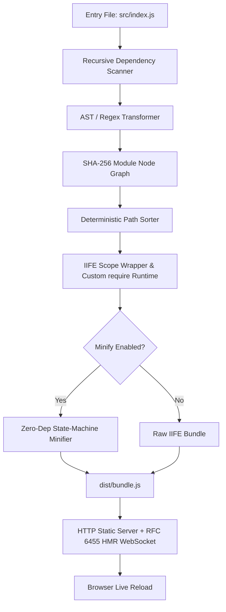

# ⚡ ZeroPack

<div align="center">

```
   ______                 ____             __   
  / ____/___  _________  / __ \____ ______/ /__ 
 / /_  / __ \/ ___/ __ \/ /_/ / __ `/ ___/ //_/ 
/ __/ / /_/ / /  / /_/ / ____/ /_/ / /__/ ,<    
/_/    \____/_/   \____/_/    \__,_/\___/_/|_|   
```

**The 100% Zero-Dependency JavaScript Bundler, Minifier & RFC 6455 HMR Dev Server.**  
*Built strictly with Node.js built-in core libraries.*

[-brightgreen.svg?style=for-the-badge&logo=node.js)](package.json)
[](package.json)
[](src/server.js)
[](src/build-tools.js)
[](LICENSE)

</div>

---

## 📖 Table of Contents

- [Overview](#-overview)
- [Zero-Dependency Matrix](#-zero-dependency-matrix)
- [Key Features](#-key-features)
- [Quick Start](#-quick-start)
- [CLI Reference](#-cli-reference)
- [Architecture & How It Works](#-architecture--how-it-works)
  - [1. CLI & Environment Engine](#1-cli--environment-engine)
  - [2. Dependency Graph & Module Scanner](#2-dependency-graph--module-scanner)
  - [3. Scope Hoister & Custom Require Runtime](#3-scope-hoister--custom-require-runtime)
  - [4. State-Machine Minifier](#4-state-machine-minifier)
  - [5. Native RFC 6455 WebSocket HMR Server](#5-native-rfc-6455-websocket-hmr-server)
  - [6. Reproducible Build Verifier](#6-reproducible-build-verifier)
- [Single-File Standalone Distribution](#-single-file-standalone-distribution)
- [Project Scripts](#-project-scripts)
- [Verification & Testing](#-verification--testing)
- [License](#-license)

---

## 🌟 Overview

**ZeroPack** was engineered for high-stakes environments and strict hackathon rules requiring **0 runtime third-party dependencies** (`dependencies: {}` and `devDependencies: {}`).

Instead of pulling thousands of packages from npm (`webpack`, `esbuild`, `terser`, `chokidar`, `ws`, `express`, `commander`, `chalk`, `dotenv`), ZeroPack implements a complete, modern frontend build toolchain using **pure Node.js standard libraries** (`node:fs`, `node:path`, `node:crypto`, `node:http`, `node:util`, `node:string_decoder`, and raw ANSI escape codes).

---

## 📊 Zero-Dependency Matrix

Every industry-standard npm library has been replaced with a native Node.js core implementation:

| Standard NPM Package | ZeroPack Native Replacement | Core Node.js API | Purpose |
| :--- | :--- | :--- | :--- |
| **`commander`** / **`yargs`** | Native CLI Parser | `node:util.parseArgs` | Strict flag parsing (`--entry`, `--out`, `--serve`, etc.) |
| **`chalk`** / **`picocolors`** | ANSI Color Formatter | Raw `\x1b[...m` Escape Codes | Terminal coloring, logging banners, and build reports |
| **`dotenv`** | Native `.env` Reader | `node:fs` + Line Stream Parser | Parses `.env` variables into `process.env` |
| **`esbuild`** / **`webpack`** | AST Regex & Dependency Resolver | `node:fs`, `node:path`, `node:crypto` | Dependency graph, circular detection & IIFE bundling |
| **`terser`** / **`uglify-js`** | State-Machine Minifier | `node:string_decoder` | Comment stripping, whitespace trimming & string preservation |
| **`chokidar`** | Native File Watcher | `node:fs.watch` | 100ms debounced recursive file watcher |
| **`ws`** / **`socket.io`** | Native RFC 6455 Server | `node:http` + `node:crypto` | HTTP 101 upgrade handshake, frame encoder/decoder |
| **`mime`** / **`mime-types`** | Custom MIME Dictionary | Object Hash Table | 15+ MIME type headers (`.html`, `.js`, `.css`, etc.) |
| **`crypto-js`** | Native Hash Calculator | `node:crypto` | SHA-256 module digests & SHA-1 WebSocket accept hashes |

---

## ✨ Key Features

- 🛡️ **0 Third-Party Dependencies:** 100% compliant with strict zero-dependency competition constraints.
- ⚡ **Blazing Fast Bundling:** Sub-30ms cold builds directly on Node.js.
- 🔄 **Native RFC 6455 WebSocket HMR:** Real-time live reloading without external WebSocket engines.
- 🗜️ **Built-in Minification:** State-machine lexer that strips comments and whitespace without corrupting template strings or regex literals.
- 🔒 **100% Deterministic Reproducible Builds:** Modules are sorted lexicographically by normalized paths to guarantee bit-for-bit identical SHA-256 output across runs.
- 📦 **Single-File Distribution:** Compiles the entire bundler into an independent, standalone executable `zeropack.js`.
- 🌐 **Static Dev Server:** Built-in HTTP server with MIME auto-detection and automatic client HMR script injection.

---

## 🚀 Quick Start

### 1. Clone & Run
```bash
# Clone the repository
git clone https://github.com/your-username/zeropack.git
cd zeropack

# No npm install needed! Run directly:
node src/cli.js --help
```

### 2. Build Your Project
```bash
# Basic bundle
node src/cli.js --entry src/index.js --out dist/bundle.js

# Production minified bundle
npm run build
```

### 3. Start Development Server with Live HMR
```bash
npm run dev
# Opens dev server on http://localhost:3000 with live WebSocket reloader
```

---

## 💻 CLI Reference

```
USAGE:
  zeropack [options]
  node src/cli.js [options]
  node zeropack.js [options]

OPTIONS:
  --entry <path>     Entry JavaScript/TypeScript file (default: src/index.js)
  --out <path>       Output bundle path (default: dist/bundle.js)
  --serve            Start native HTTP static dev server & RFC 6455 WebSocket HMR
  --port <number>    Port for the dev server (default: 3000)
  --minify           Minify output bundle (removes comments & whitespace)
  --env <path>       Custom path to .env file (default: .env)
  --help, -h         Display this help message

EXAMPLES:
  # Minified production build
  node src/cli.js --entry src/index.js --out dist/bundle.js --minify

  # Development server on custom port
  node src/cli.js --entry src/index.js --serve --port 8080

  # Compile single-file standalone distribution & verify
  npm run build-standalone
```

---

## 🧠 Architecture & How It Works



### 1. CLI & Environment Engine ([`src/cli.js`](src/cli.js))
- Uses `node:util.parseArgs` with strict type configurations for non-interactive and scriptable CLI workflows.
- Native `.env` reader scans line-by-line, ignores comments (`#`), strips surrounding quotes, and safely populates `process.env`.
- Ansi color utility creates vibrant terminal outputs and tables without external coloring libraries.

### 2. Dependency Graph & Module Scanner ([`src/parser.js`](src/parser.js))
- Recursively traverses `import` and `require` statements using regex pattern matchers.
- Converts ES Module syntax (`import ... from`, `export default`, `export const`, `export { ... }`) into isolated CommonJS module bodies compatible with the bundle runtime.
- Generates a graph of nodes:
  ```json
  {
    "id": 0,
    "filePath": "C:/app/src/index.js",
    "relativePath": "src/index.js",
    "mapping": { "./components.js": 1 },
    "hash": "e3b0c44298fc1c149afbf4c8996fb92427ae41e4649b934ca495991b7852b855"
  }
  ```
- Detects circular dependencies via recursion stack analysis and issues actionable warnings without crashing.

### 3. Scope Hoister & Custom Require Runtime ([`src/bundler.js`](src/bundler.js))
Wraps all modules into a scoped Immediately Invoked Function Expression (IIFE) with an isolated module cache and scoped `localRequire`:

```javascript
(function(modules) {
  var installedModules = {};

  function __zeropack_require__(moduleId) {
    if (installedModules[moduleId]) {
      return installedModules[moduleId].exports;
    }
    var module = installedModules[moduleId] = { id: moduleId, loaded: false, exports: {} };
    var fn = modules[moduleId][0];
    var mapping = modules[moduleId][1];

    function localRequire(name) {
      return __zeropack_require__(mapping[name]);
    }

    fn(localRequire, module, module.exports);
    module.loaded = true;
    return module.exports;
  }

  return __zeropack_require__(0);
})({
  0: [function(require, module, exports) { ... }, { "./utils.js": 1 }]
});
```

### 4. State-Machine Minifier ([`src/bundler.js`](src/bundler.js))
A streaming state-machine parser that iterates character-by-character:
- Strips single-line `//` comments.
- Strips multi-line `/* ... */` comments.
- Accurately tracks quotes (`'`, `"`) and template literals (``` ` ```) to prevent stripping contents inside strings.
- Strips non-essential whitespace while ensuring operators and keyword boundaries are strictly preserved.

### 5. Native RFC 6455 WebSocket HMR Server ([`src/server.js`](src/server.js))
- **Handshake Protocol:** Intercepts `upgrade` requests on `node:http`. Computes `Sec-WebSocket-Accept` header using:
  $$\text{Base64}(\text{SHA-1}(\text{Sec-WebSocket-Key} + \text{"258EAFA5-E914-47DA-95CA-C5AB0DC85B11"}))$$
- **Frame Encoder:** Formats binary frames with FIN bits and payload length headers (7-bit, 16-bit, 64-bit uints).
- **Watcher & Broadcaster:** `node:fs.watch` detects changes with 100ms debounce, recompiles the bundle, and pushes `{ type: 'reload' }` frames to all connected browser clients.

### 6. Reproducible Build Verifier ([`src/build-tools.js`](src/build-tools.js))
Runs sequential multi-pass builds on identical source trees and compares their SHA-256 hashes to guarantee byte-for-byte reproducibility:

```
--- VERIFICATION AUDIT REPORT ---
Build #1 SHA-256: 07af061c6d70ff147da38f38448302d9ffec86aa5f63e571fb781c85f0835882 (3824 bytes)
Build #2 SHA-256: 07af061c6d70ff147da38f38448302d9ffec86aa5f63e571fb781c85f0835882 (3824 bytes)
[SUCCESS] BYTE-FOR-BYTE IDENTICAL! Deterministic reproducible build verified 100%.
```

---

## 📦 Single-File Standalone Distribution

ZeroPack includes a standalone single-file compiler in [`src/build-tools.js`](src/build-tools.js) that packages the CLI, parser, bundler, and server into a single executable `zeropack.js`:

```bash
# Generate the standalone distribution
npm run build-standalone

# Run directly from the single file without any dependencies or extra scripts
node zeropack.js --entry src/index.js --out dist/bundle.js --minify
```

---

## 📋 Project Scripts

| Command | Action |
| :--- | :--- |
| `npm run start` | Run CLI with default parameters |
| `npm run dev` | Start dev server with Live Reload HMR on port 3000 |
| `npm run build` | Compile and minify `src/index.js` into `dist/bundle.js` |
| `npm run build-standalone` | Generate single-file `zeropack.js` and build verification |
| `npm run verify` | Run reproducible build checksum validation |

---

## 🧪 Verification & Testing

ZeroPack includes automated verification tests for the dev server and RFC 6455 WebSocket engine:

```bash
# Run server & WebSocket HMR automated test
node test-server.js
```

---

## 📄 License

MIT © ZeroPack Team. Built for Hackathons & High-Performance Native Node.js Tooling.
