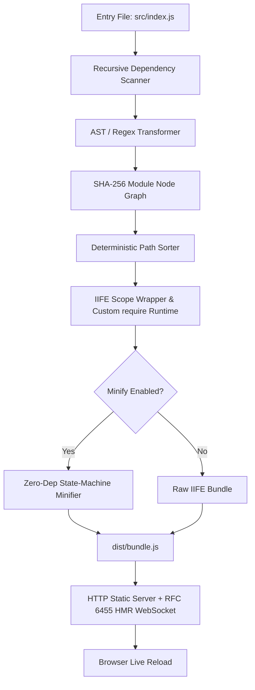

# ⚡ ZeroPack

<div align="center">

```
   ______                 ____             __   
  / ____/___  _________  / __ \____ ______/ /__ 
 / /_  / __ \/ ___/ __ \/ /_/ / __ `/ ___/ //_/ 
/ __/ / /_/ / /  / /_/ / ____/ /_/ / /__/ ,<    
/_/    \____/_/   \____/_/    \__,_/\___/_/|_|   
```

**The 100% Zero-Dependency JavaScript Bundler, Minifier & RFC 6455 HMR Dev Server.**  
*Built strictly with Node.js built-in core libraries.*

[-brightgreen.svg?style=for-the-badge&logo=node.js)](package.json)
[](package.json)
[](src/server.js)
[](src/build-tools.js)
[](LICENSE)

</div>

---

## 📖 Table of Contents

- [Overview](#-overview)
- [Zero-Dependency Matrix](#-zero-dependency-matrix)
- [Key Features](#-key-features)
- [Quick Start](#-quick-start)
- [CLI Reference](#-cli-reference)
- [Architecture & How It Works](#-architecture--how-it-works)
  - [1. CLI & Environment Engine](#1-cli--environment-engine)
  - [2. Dependency Graph & Module Scanner](#2-dependency-graph--module-scanner)
  - [3. Scope Hoister & Custom Require Runtime](#3-scope-hoister--custom-require-runtime)
  - [4. State-Machine Minifier](#4-state-machine-minifier)
  - [5. Native RFC 6455 WebSocket HMR Server](#5-native-rfc-6455-websocket-hmr-server)
  - [6. Reproducible Build Verifier](#6-reproducible-build-verifier)
- [Single-File Standalone Distribution](#-single-file-standalone-distribution)
- [Project Scripts](#-project-scripts)
- [Verification & Testing](#-verification--testing)
- [License](#-license)

---

## 🌟 Overview

**ZeroPack** was engineered for high-stakes environments and strict hackathon rules requiring **0 runtime third-party dependencies** (`dependencies: {}` and `devDependencies: {}`).

Instead of pulling thousands of packages from npm (`webpack`, `esbuild`, `terser`, `chokidar`, `ws`, `express`, `commander`, `chalk`, `dotenv`), ZeroPack implements a complete, modern frontend build toolchain using **pure Node.js standard libraries** (`node:fs`, `node:path`, `node:crypto`, `node:http`, `node:util`, `node:string_decoder`, and raw ANSI escape codes).

---

## 📊 Zero-Dependency Matrix

Every industry-standard npm library has been replaced with a native Node.js core implementation:

| Standard NPM Package | ZeroPack Native Replacement | Core Node.js API | Purpose |
| :--- | :--- | :--- | :--- |
| **`commander`** / **`yargs`** | Native CLI Parser | `node:util.parseArgs` | Strict flag parsing (`--entry`, `--out`, `--serve`, `--sourcemap`, etc.) |
| **`chalk`** / **`picocolors`** | ANSI Color Formatter | Raw `\x1b[...m` Escape Codes | Terminal coloring, logging banners, and build reports |
| **`dotenv`** | Native `.env` Reader | `node:fs` + Line Stream Parser | Parses `.env` variables into `process.env` |
| **`esbuild`** / **`webpack`** | AST Regex & Dependency Resolver | `node:fs`, `node:path`, `node:crypto` | Dependency graph, circular detection & IIFE bundling |
| **`resolve`** / **`enhanced-resolve`** | Native Node.js Resolution Engine | `node:fs` + `node:path` | Bare `node_modules` resolution (`exports`, `module`, `main`) |
| **`source-map`** / **`vlq`** | Native Base64 VLQ Generator | Custom v3 VLQ Math Encoder | Source map v3 generation for minified & unminified builds |
| **`typescript`** / **`ts-node`** | Native Type Stripping Engine | `node:module` (`stripTypeScriptTypes`) | Direct `.ts` compilation on Node >= 22.6 with zero libraries |
| **`terser`** / **`uglify-js`** | State-Machine Minifier | `node:string_decoder` | Comment stripping, whitespace trimming & string preservation |
| **`chokidar`** | Native File Watcher | `node:fs.watch` | 100ms debounced recursive file watcher |
| **`ws`** / **`socket.io`** | Native RFC 6455 Server | `node:http` + `node:crypto` | HTTP 101 upgrade handshake, frame encoder/decoder |
| **`mime`** / **`mime-types`** | Custom MIME Dictionary | Object Hash Table | 15+ MIME type headers (`.html`, `.js`, `.css`, etc.) |
| **`crypto-js`** | Native Hash Calculator | `node:crypto` | SHA-256 module digests & SHA-1 WebSocket accept hashes |

---

## ✨ Key Features

- 🛡️ **0 Third-Party Dependencies:** 100% compliant with strict zero-dependency competition constraints.
- ⚡ **Blazing Fast Bundling:** Sub-30ms cold builds directly on Node.js.
- 🗺️ **Source Maps v3:** Hand-crafted Base64 VLQ encoder generating compliant `.map` files for both unminified and minified outputs.
- 📦 **node_modules Resolution:** Full bare-import resolution following Node's algorithm (`exports`, `module`, `main`, and index fallbacks) with structured `BuildError` diagnostics.
- 🔷 **Native TypeScript Support:** Automatic `.ts` type stripping using native `node:module` built-ins.
- 🔄 **Native RFC 6455 WebSocket HMR:** Real-time live reloading without external WebSocket engines.
- 🗜️ **Robust State-Machine Minifier:** Lexer preserving ASI (Automatic Semicolon Insertion), operator spacing (`+ +`, `- -`), regex literals vs. division, and nested template literals with `${}`.
- 🧩 **Comprehensive ESM $\to$ CJS Transforms:** Full support for destructured exports, namespace re-exports (`export * as ns`, `export *`), import attributes (`with`/`assert`), unpolluted default exports, and live getter bindings.
- 🔒 **100% Deterministic Reproducible Builds:** Modules are sorted lexicographically by normalized paths to guarantee bit-for-bit identical SHA-256 output across runs.
- 📦 **Single-File Distribution:** Compiles the entire bundler into an independent, standalone executable `zeropack.js`.
- 🌐 **Static Dev Server:** Built-in HTTP server with MIME auto-detection and automatic client HMR script injection.

---

## 🚀 Quick Start

### 1. Zero-Config Experience (User shouldn't have to do anything!)
```bash
# Running with no arguments auto-detects entry, finds an open port, and opens browser:
zeropack

# Or using the standalone executable directly:
node zeropack.js
```

### 2. Scaffold a New Project
```bash
# Scaffold a minimal zero-dependency starter project:
zeropack init my-new-app
```

### 3. Build & Serve Subcommands
```bash
# One-shot minified production build with source maps
zeropack build --minify --sourcemap

# Start dev server with Live WebSocket HMR
zeropack serve

# Compile-time variable replacement (e.g., React / modern libraries)
zeropack build --define process.env.NODE_ENV=production
```

---

## 💻 CLI Reference

```
USAGE:
  zeropack [subcommand] [options]
  node src/cli.js [subcommand] [options]
  node zeropack.js [subcommand] [options]

SUBCOMMANDS:
  init [dir]         Scaffold a minimal ZeroPack starter project
  build [entry]      One-shot bundle production build
  serve [entry]      Start dev server with Live Reload & RFC 6455 WebSocket HMR

OPTIONS:
  --entry, -e <path>     Entry file (auto-detected: package.json module/main, src/index.js, index.js)
  --out, -o <path>       Output bundle path (default: dist/bundle.js)
  --serve                Start native HTTP static dev server & RFC 6455 WebSocket HMR
  --port, -p <number>    Dev server port (default: 3000, auto-finds free port if busy)
  --host <string>        Dev server host (default: localhost)
  --open                 Open browser when dev server starts (default for zero-arg invocation)
  --no-open              Do not open browser
  --minify, -m           Minify output bundle (removes comments & extraneous whitespace)
  --sourcemap, -s        Generate Source Map v3 (.map file)
  --config, -c <path>    Path to configuration file (default: zeropack.config.json)
  --define <key=val>     Compile-time define replacement (e.g. process.env.NODE_ENV=production)
  --env <path>           Custom path to .env file (default: .env)
  --version, -v          Display ZeroPack version
  --help, -h             Display this help message

CONFIGURATION FILE (zeropack.config.json):
{
  "entry": "src/index.js",
  "out": "dist/bundle.js",
  "port": 3000,
  "minify": false,
  "sourcemap": true,
  "define": {
    "process.env.NODE_ENV": "development",
    "API_URL": "https://api.example.com"
  }
}
```

---

## 🧠 Architecture & How It Works



### 1. CLI & Environment Engine ([`src/cli.js`](src/cli.js))
- Uses `node:util.parseArgs` with strict type configurations for non-interactive and scriptable CLI workflows.
- Native `.env` reader scans line-by-line, ignores comments (`#`), strips surrounding quotes, and safely populates `process.env`.
- Ansi color utility creates vibrant terminal outputs and tables without external coloring libraries.

### 2. Dependency Graph & Module Scanner ([`src/parser.js`](src/parser.js))
- Recursively traverses `import` and `require` statements using regex pattern matchers.
- Converts ES Module syntax into isolated CommonJS module bodies compatible with the bundle runtime:
  - Named & default imports/exports (`import Default, { a, b as c }`, `export default`, `export { ... }`).
  - Destructured exports (`export const { x, y } = obj;`, `export const [ a, b ] = arr;`).
  - Namespace re-exports (`export * as ns from 'specifier'`, `export * from 'specifier'`).
  - Modern import attributes / assertions (`import ... with { type: 'json' }` and `assert`).
  - Live getter bindings via `Object.defineProperty` for exported mutable variables (`let`, `var`).
  - Function declaration hoisting for circular dependency resilience.
  - Clean `export default` scoping without polluting named export namespaces.
- Generates a graph of nodes:
  ```json
  {
    "id": 0,
    "filePath": "C:/app/src/index.js",
    "relativePath": "src/index.js",
    "mapping": { "./components.js": 1 },
    "hash": "e3b0c44298fc1c149afbf4c8996fb92427ae41e4649b934ca495991b7852b855"
  }
  ```
- Detects circular dependencies via recursion stack analysis and issues actionable warnings without crashing.

### 3. Scope Hoister & Custom Require Runtime ([`src/bundler.js`](src/bundler.js))
Wraps all modules into a scoped Immediately Invoked Function Expression (IIFE) with an isolated module cache and scoped `localRequire`:

```javascript
(function(modules) {
  var installedModules = {};

  function __zeropack_require__(moduleId) {
    if (installedModules[moduleId]) {
      return installedModules[moduleId].exports;
    }
    var module = installedModules[moduleId] = { id: moduleId, loaded: false, exports: {} };
    var fn = modules[moduleId][0];
    var mapping = modules[moduleId][1];

    function localRequire(name) {
      return __zeropack_require__(mapping[name]);
    }

    fn(localRequire, module, module.exports);
    module.loaded = true;
    return module.exports;
  }

  return __zeropack_require__(0);
})({
  0: [function(require, module, exports) { ... }, { "./utils.js": 1 }]
});
```

### 4. State-Machine Minifier ([`src/bundler.js`](src/bundler.js))
A streaming state-machine parser and lexer that iterates character-by-character:
- Strips single-line `//` and multi-line `/* ... */` comments.
- Preserves Automatic Semicolon Insertion (ASI) boundaries between statements without syntax corruptions.
- Accurately tracks quotes (`'`, `"`) and template literals (``` ` ```) with a lexical context stack supporting arbitrarily nested `${}` expressions.
- Preserves necessary spacing between identical unary operators (`a + +b` $\to$ `a+ +b`, `a - -b` $\to$ `a- -b`).
- Accurately disambiguates regex literals from division operators based on preceding tokens and character classes (`[...]`).

### 5. Native RFC 6455 WebSocket HMR Server ([`src/server.js`](src/server.js))
- **Handshake Protocol:** Intercepts `upgrade` requests on `node:http`. Computes `Sec-WebSocket-Accept` header using:
  $$\text{Base64}(\text{SHA-1}(\text{Sec-WebSocket-Key} + \text{"258EAFA5-E914-47DA-95CA-C5AB0DC85B11"}))$$
- **Frame Encoder:** Formats binary frames with FIN bits and payload length headers (7-bit, 16-bit, 64-bit uints).
- **Watcher & Broadcaster:** `node:fs.watch` detects changes with 100ms debounce, recompiles the bundle, and pushes `{ type: 'reload' }` frames to all connected browser clients.

### 6. Reproducible Build Verifier ([`src/build-tools.js`](src/build-tools.js))
Runs sequential multi-pass builds on identical source trees and compares their SHA-256 hashes to guarantee byte-for-byte reproducibility:

```
--- VERIFICATION AUDIT REPORT ---
Build #1 SHA-256: 1b93d34bcd6605fa389bb7298446d5fec5580e3617e8cae1cb40572d8d79d601 (3724 bytes)
Build #2 SHA-256: 1b93d34bcd6605fa389bb7298446d5fec5580e3617e8cae1cb40572d8d79d601 (3724 bytes)
[SUCCESS] BYTE-FOR-BYTE IDENTICAL! Deterministic reproducible build verified 100%.
```

---

## 📦 Single-File Standalone Distribution

ZeroPack includes a standalone single-file compiler in [`src/build-tools.js`](src/build-tools.js) that packages the CLI, parser, bundler, and server into a single executable `zeropack.js`:

```bash
# Generate the standalone distribution
npm run build-standalone

# Run directly from the single file without any dependencies or extra scripts
node zeropack.js --entry src/index.js --out dist/bundle.js --minify
```

---

## 📋 Project Scripts

| Command | Action |
| :--- | :--- |
| `npm run start` | Run CLI with default parameters |
| `npm run dev` | Start dev server with Live Reload HMR on port 3000 |
| `npm run build` | Compile and minify `src/index.js` into `dist/bundle.js` |
| `npm run build-standalone` | Generate single-file `zeropack.js` and build verification |
| `npm run verify` | Run reproducible build checksum validation |
| `npm run check` | Run full automated test suite via native `node --test` |
| `npm test` | Alias for `npm run check` |

---

## 🧪 Verification & Testing

ZeroPack includes a native, zero-dependency automated test suite leveraging Node's built-in `node:test` runner:

```bash
# Run all automated tests (unit correctness + server & WebSocket HMR)
npm run check

# Or test server standalone
node test-server.js
```

---

## 📄 License

MIT © ZeroPack Team. Built for Hackathons & High-Performance Native Node.js Tooling.
